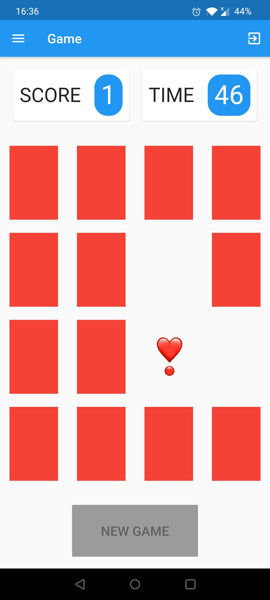

# MemoryGameMobile
 Mobile version of the popular Memory Game, powered by Flutter and Firebase.
 
 This project isn't uploaded in any store (like Google Play or App Store). If you want to try this mobile project on PC you should install an Android emulator (like [BlueStacks](https://www.bluestacks.com/it/index.html)) and install the `MemoryGameDefinitiveEdition.apk` file in the main directory.

 
 
 

